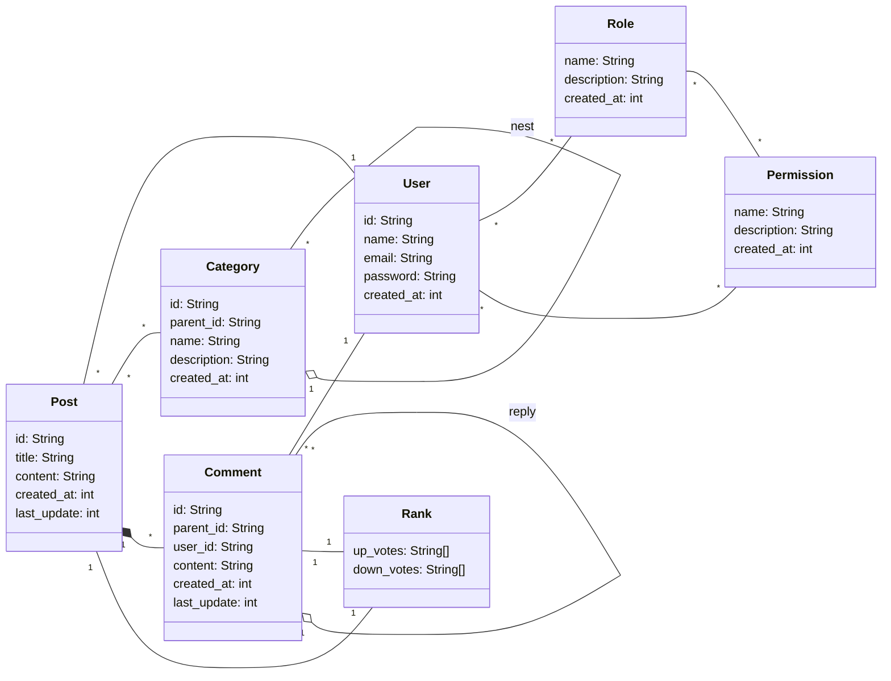

# Blog

## Actors

- Reader
- Writer/author
- Admin

## Features

- Access control: users, roles, permissions
- Blog post CRUD, categorization and search
- Comment/reply CRUD, liking (or up/down-voting)

## Requirements

...

## Diagrams

