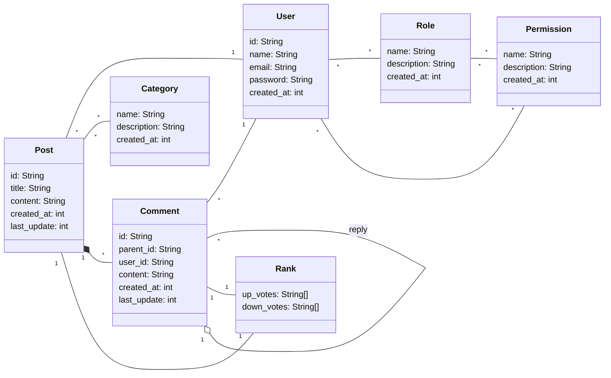

# Forum

## Overview

...

## Requirements

- The forum system manages users, posts and comments.
- A user contains: id, name, email, password and creation timestamp.
- The user password must be stored encrypted.
- The system must have user authentication.
- The system must have access control.
- Each user on the system must have roles and permissions.
- The system must support two types of users: common and super users
- The system must support three main roles: administrators, authors and readers.
- Each role and permission contains: name (unique), description and creation timestamp.
- Common users are, at the same time, authors and readers.
- Super users extend common users by being administrators (admins).
- A user can have many posts and comments.
- A post can be created, updated and deleted by one author.
- A post contains: id, title, content, timestamps (creation, last update) and comments.
- A post can be linked to multiple categories, improving search.
- A category contains: name (unique), description and creation timestamp.
- Categories must have unique names.
- Categories can only be created, updated and deleted by admins.
- A comment contains: node id, parent id, user id, content and timestamps (creation, last update).
- A comment can be linked to a post directly or indirectly by another comment (as a reply).
- A comment can be created, updated and deleted by one reader.
- Admins can delete inappropriate posts and comments from users.
- Deleting a comment does not affect its children.
- Posts and comments must be visible to any user of the system.
- Posts and comments can be ranked using and up/down-voting system.
- In the voting system, a user can only participate once, exclusively voting up or down.

## Diagrams

