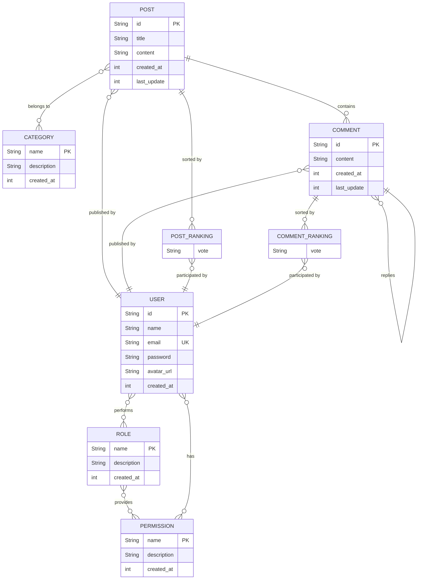

# Database Schema

> TODO: explain design choices

## ER diagram



## Relational Model

```text

USER(id, name, email, password, avatar_url, created_at)

  - id is a primary key
  - email is a unique field

ROLE(name, description, created_at)

  - name is a primary key

PERMISSION(name, description, created_at)

  - name is a primary key

USER_ROLES(user_id, role)
USER_PERMISSIONS(user_id, permission)
ROLE_PERMISSIONS(role, permission)

  - user_id, role and permission are both primary and foreign keys
  - user_id references USER.id
  - role references ROLE.name
  - permission references PERMISSION.name

POST(id, author, title, content, created_at, last_update)

  - id is a primary key
  - author is a foreign key which references USER.id

CATEGORY(name, description, created_at)

  - name is a primary key

POST_CATEGORIES(post_id, category)

  - post_id and category are both primary and foreign keys
  - post_id references POST.id
  - category references CATEGORY.name

COMMENT(id, parent_id, author, content, created_at, last_update)

  - id is a primary key
  - parent_id is a foreign key which references exclusively POST.id or COMMENT.id
  - author is a foreign key which references USER.id

RANKING(user_id, contribution_id, vote)

  - user_id and contribution_id are both primary and foreign keys
  - user_id references USER.id
  - contribution_id references exclusively POST.id or COMMENT.id

```
