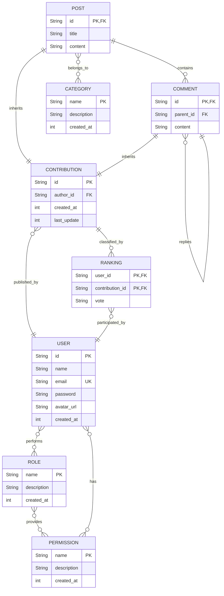

# Database Schema

> TODO: explain design choices
> update schema according to docs

## ER diagram

```mermaid
  erDiagram
    USER {
      String id PK
      String name
      String email UK
      String password
      String avatar_url
      int created_at
    }

    ROLE {
      String name PK
      String description
      int created_at
    }

    PERMISSION {
      String name PK
      String description
      int created_at
    }

    CONTRIBUTION {
      String id PK
      String author_id FK
      int created_at
      int last_update
    }

    POST {
      String id PK, FK
      String title
      String content
    }

    CATEGORY {
      String name PK
      String description
      int created_at
    }

    COMMENT {
      String id PK, FK
      String parent_id FK
      String content
    }

    RANKING {
      String user_id PK, FK
      String contribution_id PK, FK
      String vote
    }

    USER }o--o{ ROLE: performs
    ROLE }o--o{ PERMISSION: provides
    USER }o--o{ PERMISSION: has

    POST ||--|| CONTRIBUTION: inherits
    COMMENT ||--|| CONTRIBUTION: inherits

    CONTRIBUTION }o--|| USER: published_by

    POST }o--o{ CATEGORY: belongs_to

    POST ||--o{ COMMENT: contains
    COMMENT }o--|| COMMENT: replies

    CONTRIBUTION ||--o{ RANKING: classified_by
    RANKING }o--|| USER: participated_by
```
