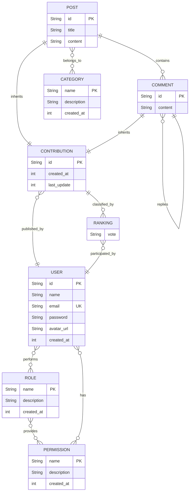

# Database Schema

> TODO: explain design choices
> update schema according to docs

## ER diagram



## Relational Model

```text

USER(id, name, email, password, avatar_url, created_at)

  - id is a primary key
  - email is a unique field

ROLE(name, description, created_at)

  - name is a primary key

PERMISSION(name, description, created_at)

  - name is a primary key

USER_ROLES(user_id, role_name)
USER_PERMISSIONS(user_id, permission_name)
ROLE_PERMISSIONS(role_name, permission_name)

  - user_id, role_name and permission_name are both primary and foreign keys
  - user_id references USER.id
  - role_name references ROLE.name
  - permission_name references PERMISSION.name

CONTRIBUTION(id, author_id, created_at, last_update)

  - id is a primary key
  - author_id is a foreign key which references USER.id

POST(id, title, content)

  - id is a primary key and a foreign key which references CONTRIBUTION.id

CATEGORY(name, description, created_at)

  - name is a primary key

POST_CATEGORIES(post_id, category_name)

  - post_id and category_name are both primary and foreign keys
  - post_id references POST.id
  - category_name references CATEGORY.name

COMMENT(id, parent_id, content)

  - id is a primary key and a foreign key which references CONTRIBUTION.id
  - parent_id is a foreign key which references CONTRIBUTION.id

RANKING(user_id, contribution_id, vote)

  - user_id and id are both primary and foreign keys
  - user_id references USER.id
  - contribution_id references CONTRIBUTION.id

```
